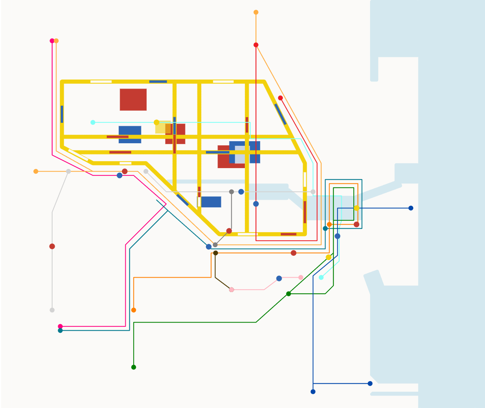

# IDEA9103_CreativeCodingMajorProject_SydneyRailBroadway

**Group |** USYD 2025 S2 IDEA9103 Jared Group C
<br>



### 1. Concept & Artistic Intent

This project reimagines Sydney’s railway network through the lens of Piet Mondrian’s geometric abstraction.
The idea is to transform the central Broadway area into a living town structure, where train lines become visual compositions, and moving elements reflect the rhythm of urban life.

By combining the random geometry of Mondrian’s style with the functional flow of real rail lines,
the work seeks to capture the tension between order and pressure in modern cities.
Fast-moving colors and shifting shapes mirror the pace and stress of contemporary society,
turning the city map into both a machine of movement and a metaphor for modern existence. The continuous motion reflects the idea that a city never truly rests —
its systems, also like its people, are always in motion.
<br>

### 2. Canvas Setup and Scaling Process

The initial prototype used a 600 × 500 pixel canvas, mainly for testing path logic and shape density.
As the composition expanded, the canvas was scaled to 1000 × 800 pixels with 960 (times by 1.6)+20px margin both sides to better accommodate the complexity of the Mondrian-style layout and Sydney’s rail paths. The larger canvas improved clarity, allowing more breathing space between zones
and a stronger sense of architectural balance.
<br>

### 3. Geometric Principles of the Town Structure

The Mondrian Town is generated through controlled randomness and geometric validation,
ensuring every visual element feels organic yet structurally coherent.

(1) Rejection Sampling — Controlled Random Placement

Rectangles are placed inside an irregular polygon using rejection sampling:
the system repeatedly generates random rectangle positions and sizes
and keeps only those that fully fit inside the city boundary.

```javascript
  if (insidePolyWithMargin(cx, cy, w/2, h/2, outline)) {
    addRectangle(cx, cy, w, h);
  } else {
    i--;
  }
```

This approach produces natural randomness while maintaining geometric discipline.
Each rectangle feels unique but still respects the overall boundary.

(2) Ray Casting — Point-in-Polygon Detection

The ray casting algorithm (even–odd rule) checks whether a point lies inside a polygon.
A horizontal ray is projected from each test point, and every time it crosses a polygon edge,
the "inside/outside" state flips.
An odd number of crossings means inside; even means outside.

```javascript
function pointInPolygon(px, py, vertices) {
  let inside = false;
  for (let i = 0, j = vertices.length - 1; i < vertices.length; j = i++) {
    let xi = vertices[i].x, yi = vertices[i].y;
    let xj = vertices[j].x, yj = vertices[j].y;

    let intersect = ((yi > py) !== (yj > py)) &&
                    (px < (xj - xi) * (py - yi) / (yj - yi) + xi);
    if (intersect) inside = !inside;
  }
  return inside;
}
```

This method ensures rectangles and other generated elements never exceed the city’s boundary,
keeping the structure precise and believable.

(3) Sorted Random Grids

```javascript
  // Ensure grid lines are ordered from left to right.
  townGridXs.sort((a, b) => a - b);
```

To create visual rhythm, random grid lines are sampled and then sorted to generate
orderly but non-uniform divisions — echoing Mondrian’s idea of dynamic balance within order.
<br>

### 4. Vector-Based Car Animation

Movement across the town is handled by p5.Vector,
which allows cars to smoothly follow each polyline representing a train line.

Each car travels along its path by measuring distance along line segments,
and its position is calculated using linear interpolation:

```javascript
let pos = p5.Vector.lerp(a, b, t);
```

Here:

a and b are the start and end points of the current segment, t is a normalized value between 0 and 1,
representing how far along the segment the car has traveled.

Each frame, the car’s total distance dist increases based on its speed.
Once dist exceeds the total path length, it loops back to zero (for circular lines)
or reverses direction (for pingpong lines).
<br>
<br>

The system’s structure:

Car Class defines color, radius, and movement behavior.

initCars() creates one car per railway line, assigning random colors and speeds.

advanceCars() updates motion each frame.

drawCars() renders cars based on their interpolated positions.

This modular design would make it easier to extend later with audio, time, noise, or user-input interactions.
<br>

### 5. Conclusion

At this stage, the project builds a procedural visual system
that connects geometric abstraction with real-world transport dynamics.
It blends random generation, vector-based motion, and color composition
to simulate a living, breathing city.

### Thank You :)
